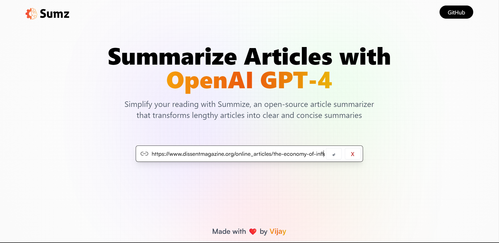

# Sumz 📚

<ul>
<li>Summarize Articles with OpenAI GPT-4.</li>
<li>Simplify your reading with Summize, an open-source article summarizer that transforms lengthy articles into clear and concise summaries.</li>
  
</ul>

 

 

## Preview

| 1. Go to our app Sumz.                              |     |
| --------------------------------------------------- | ---------------------------------------------- |
| 2. Click on `Search Bar` and paste the article URL. |  |
| 3. Wait for `5 - 10 Seconds`.                       |  |
| 4. Your `Summary` generated.                        |  |

## Thanks for Reading!
